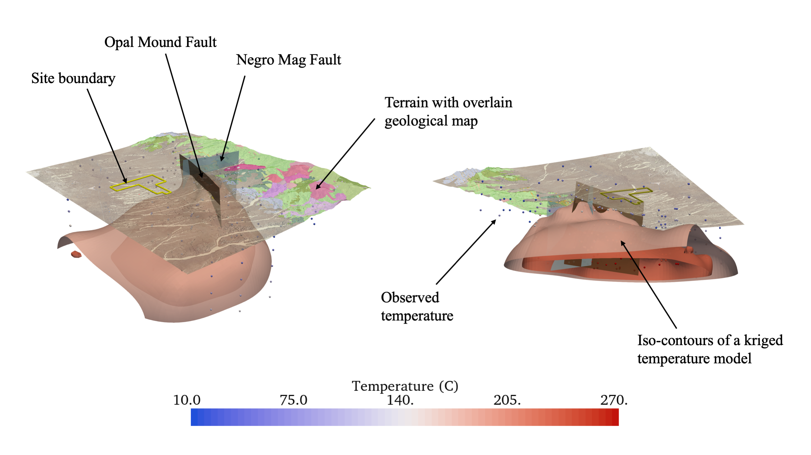
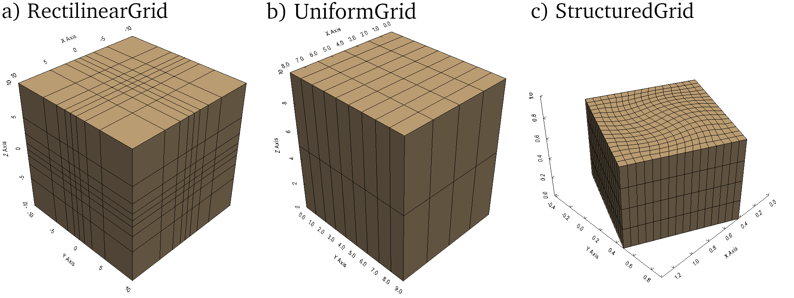
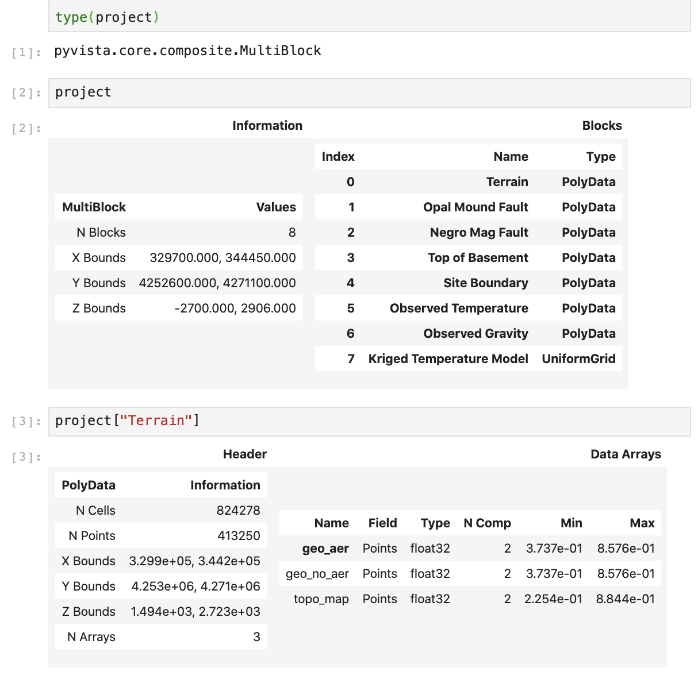
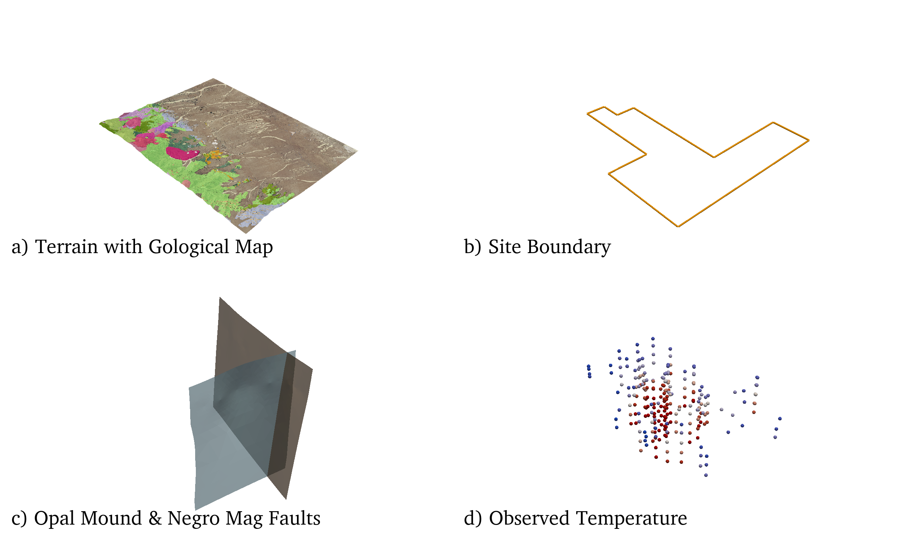
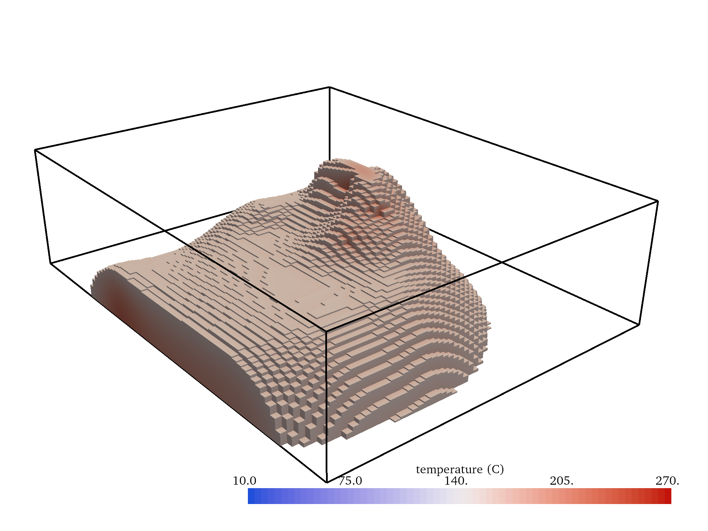
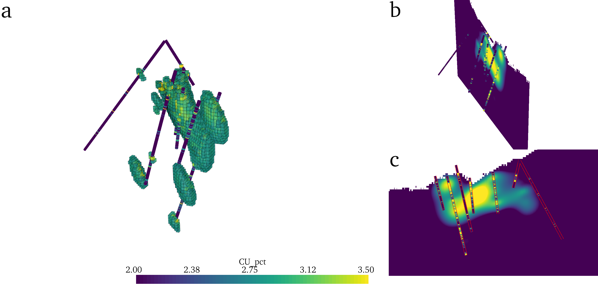
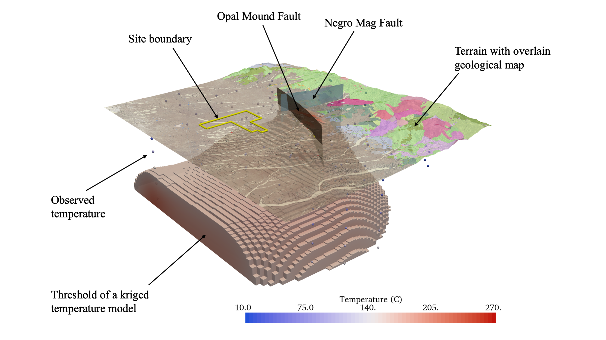

Introducing PyVista
===================

`PyVista <https://docs.pyvista.org>`_, a 3D data management and visualization software, has been developed along with a suite of companion software, including `PVGeo <https://pvgeo.org>`_ and `omfvista <https://opengeovis.github.io/omfvista/>`_, to manage, analyze, and visualize 3D geoscientific data and models in a common geo-referenced framework. This chapter provides a look into the PyVista software framework and how it is leveraged to manage and visualize geospatial data providing insight throughout Python geocomputing workflows.
Geoscientists rely on calibrating and integrating data with all types of subsurface information to further illuminate the value of modeling results and to gain insight into the research questions at hand. This software, PyVista, extends the functionality of the open-source visualization platform the Visualization Toolkit (VTK) :cite:p:`vtkbook` by `Kitware Inc. <https://kitware.com>`_ and makes it possible to integrate geoscientific information in a multidimensional rendering space much like :numref:`integrated-scene`, where viewers can relate geophysical and hydrological data/models to intuitive features like topography and well locations. The PyVista software is published in the `Journal of Open Source Software <https://joss.theoj.org>`_. This chapter provides an introduction to PyVista and an overview of applications in the geosciences. Similarly, the PVGeo companion software is published in the Journal of Open Source Software and is included in Appendix A.

.. panels::
    :column: col-lg-12 p-2

    .. link-button:: https://doi.org/10.21105/joss.01450
        :type: url
        :text: See the paper on PyVista
        :classes: btn-outline-primary btn-block stretched-link

.. _forge-iso:

    A visually integrated scene of geospatial data (FORGE Geothermal Site): left) view from upper south-west and right) view from lower north-west.

Data Management & Visualization
-------------------------------

The PyVista software package has two primary modules: 1) the core module, the fundamental data structures for managing spatially-referenced information, and 2) the plotting module, a comprehensive toolset for creating integrated 3D visualizations of the core data structures. The following sections outline how PyVista’s generalized data structures provide an extensible framework for managing geoscientific data and how PyVista’s data management approach to 3D visualization can be leveraged for insight throughout geocomputing workflows.

Data Structures
~~~~~~~~~~~~~~~

Geoscientific data and models are discrete, a fact arising from how we acquire and represent these data in digital form as geospatial data represents distinct points or regions in 3D space. The nature of spatial data requires that any computational framework for managing and analyzing those data have discretized structures for containing those data. VTK, and PyVista by extension, is a framework with discrete structures that can handle the majority of 3D data types found in subsurface science. As such, PyVista creates a platform for managing spatially-referenced data and visualizing those data in a robust 3D rendering platform aiming to make analysis and visualization routines more accessible in Python. PyVista implements the spatial data structures listed in Table 2.1 to make creating, managing, and analyzing VTK data types more streamlined for domain scientists. These spatial data structures, commonly referred to as datasets, consist of *geometry*, *topology*, and *attributes* to which PyVista provides direct access over a NumPy interface.

* Geometry is the collection of points and cells in 2D or 3D space.
* Topology defines the structure of the dataset, or how the points are connected to form cells defining a surface or volume.
* Attributes are any data values that are associated with either the points (the nodes) or cells (regions between the nodes) of the dataset.

As mentioned in Section 1.1, there is a wide variety of data types used in geoscientific research settings; all of the examples listed have a corresponding class (data structure) in PyVista. For instance, :numref:`polydata` shows how ``PolyData`` can represent a) point clouds, b) DEMs with overlain imagery, c) sparse observational data, d) geospatial line sets, and e) bounding surfaces within structural geology models. Furthermore, gridded volumes can be represented by either the ``RectilinearGrid`` or ``UniformGrid`` classes, meshed volumes and surfaces with a gridded structure can be represented by the ``StructuredGrid`` class, and meshed volumes and surfaces of arbitrary geometry can be represented by the ``UnstructuredGrid`` class.

TODO: insert table

.. _polydata:
.. figure:: ./images/polydata.png

   Common forms of geoscientific data that can be represented as 1D and 2D geometries in 3D space via the PolyData class.

Typically in subsurface geoscience, researchers leverage RectilinearGrid, UniformGrid, and StructuredGrid data structures for 3D modeling (shown in :numref:`mesh-compare`). A RectilinearGrid is commonly used when the volume is aligned with the cartesian axes and varying cell size
is desired along each of the axes. The UniformGrid is used likewise when the volume is aligned with the cartesian axes, but when the cell size along a given axis is uniformly defined. The StructuredGrid class is also commonly used when dealing with meshed volumes of arbitrary rotation or curvilinear internal structures. The examples in :numref:`mesh-compare` show these three common mesh types in a simplified form, but these types are often used at a larger scale in extensive geophysical modeling frameworks like SimPEG :cite:p:`simpeg` where there are equivalent classes for the RectilinearGrid and StructuredGrid types.

.. _mesh-compare:

    Three commonly used mesh/volume types used in subsurface modeling applications.

The data in :numref:`forge-iso` primarily utilizes PyVista’s PolyData type to represent the faulting planes, geospatial site boundary, terrain surface, and subsurface temperature measurements but also leverages PyVista’s UniformGrid type for the 3D temperature model that is iso-contoured. These data can be collected into a single PyVista MultiBlock composite structure, as shown in output 2 of :numref:`multi-block`, that is used to manage all of these spatial data in a computational environment. MultiBlock objects streamline accessing and managing each dataset as well as creating integrated visualizations. Any dataset for the project can be accessed by name from the container shown in :numref:`multi-block`, such as the Terrain mesh by the code project[‘Terrain’] yielding the PolyData mesh in output 3. Further, each dataset in this data structure can be utilized an visualized individually as shown in :numref:`forge-all`.

PyVista’s data structures make it possible to collect, manage, and track all of the spatial information for a given subsurface investigation in a consistent and accessible framework. These data structures are each co-located in a shared geo-referenced coordinate system making interpretation and analysis a fluid and interactive process for researchers as well as providing straightforward routines to visually fuse datasets, combine attributes, and gain insight into the spatial relationships of the data before and during scientific processing.

.. _multi-block:

    An example output of PyVista data containers in a Jupyter Python environment.

.. _forge-all:

    Several of the datasets from the data structure in :numref:`multi-block` shown individually.

Once the data for a workflow are collected into PyVista data structures, aspects of the data like their bounding boxes, coordinates, center locations, etc. are accessible via properties directly bound to those objects. Likewise, further analysis routines are accessible as bound filtering methods available on all PyVista objects. For example, a subset can be extracted from a volumetric dataset via the code in :numref:`threshold-code` to produce the mesh shown in :numref:`threshold-example`. PyVista’s immediate access to data information, attributes, and analysis routines provides a toolset for rapidly inspecting and gaining insight from spatial data in an interactive computing environment. Full documentation of the API for PyVista data structures and how users can interact with the bound properties and methods can be found within `PyVista’s online documentation <https://docs.pyvista.org>`_.

Example code to threshold a the Kriged Temperature Model creating an UnstructuredGrid mesh where the temperature is above 150 degrees C:

.. _threshold-code:
.. code:: python

  model = project [ "Kriged Temperature Model" ]
  threshold = model.threshold(150)

.. _threshold-example:

    A threshold of the the Kriged Temperature Model produced from :numref:`threshold-code` at 150 degrees C.

Visual Data Fusion
~~~~~~~~~~~~~~~~~~

Visual data fusion is often used to gain insight into the spatial trends and relationships between several datasets, insights that can be achieved through visualization and exploration with PyVista. To explore the spatial relationships of several datasets, a researcher would visualize those data sources in a common geo-referenced scene for exploration. For example, :numref:`fusion` demonstrates visual data fusion between a resource model and borehole data in 3D (a and b) and in 2D (c). :numref:`fusion` shows the 3D resource model threshold at a value of interest (a) and sliced along a plane (b and c) with co-located borehole measurements in 3D (a and b) and projected to the same plane (c). The 2D scene in :numref:`fusion`-c shows the borehole data projected to the same viewing plane as the cross-section leading to visual differences between the model and the borehole data; this 2D representation of the data only partially represents the 3D variability of the model. Through leveraging PyVista’s data management framework, researchers have a toolset for accessing, filtering, and visually fusing all the spatial data for their workflow through an intuitive, programmatic interface: enabling the creation of sophisticated 3D visualizations in a reproducible fashion.

Similarly, integrated 3D visualizations of the data listed in :numref:`multi-block` can be created in a few lines of code when managing the data via PyVista throughout a research workflow. PyVista’s plotting routines are built to directly handle the spatial data types such that these objects can be directly passed to a routine for rapid visual data fusion. In Listing 2.2, several of the datasets from the composite structure in :numref:`multi-block` are fetched and passed to a PyVista Plotter instance which creates a 3D rendering scene; each object is passed with a set of descriptive keyword arguments to define how that dataset is displayed (e.g., color, opacity, and point size). The code in :numref:`multi-block-plot` produces the fully integrated scene shown in :numref:`forge-iso`. The contouring filter applied in Listing 2.2 as .contour([175, 225]) could changed to a thresholding filter as .threshold(150) from Listing 2.1 to extract the volumetric region where the scalar data is above those the given value: this result is shown in :numref:`forge-2`.

.. _fusion:

    Examples of visual fusion between two datasets: a 3D resource model and borehole measurements.

The code to produce the 3D visualization shown in :numref:`forge-iso` from the MultiBlock dataset in :numref:`multi-block`:

.. _multi-block-plot:
.. code:: python

  p = pyvista.Plotter()
  p.add_mesh(project["Site Boundary"],
             color="yellow" , render_lines_as_tubes=True)
  p.add_mesh(project ["Terrain"] ,
             texture="geo_aer", opacity=0.7, lighting=False)
  p.add_mesh(project["Opal Mound Fault"],
             color="brown" , opacity =0.7)
  p.add_mesh(project["Negro Mag Fault"],
             color="lightblue", opacity=0.7)
  p.add_mesh(project["Kriged Temperature Model"].contour([175, 225]),
             cmap="coolwarm" , clim =[10 ,270] , opacity =0.9)
  p.add_mesh(project ["Observed Temperature"] ,
             cmap="coolwarm", clim=[10,270], point_size=10,
             render_points_as_spheres=True)
  p.show()

.. _forge-2:

    The same geospatial data from :numref:`forge-iso` (FORGE Geothermal Site9) with a threshold temperature model as produced from Listing 2.1 and Listing 2.2.
