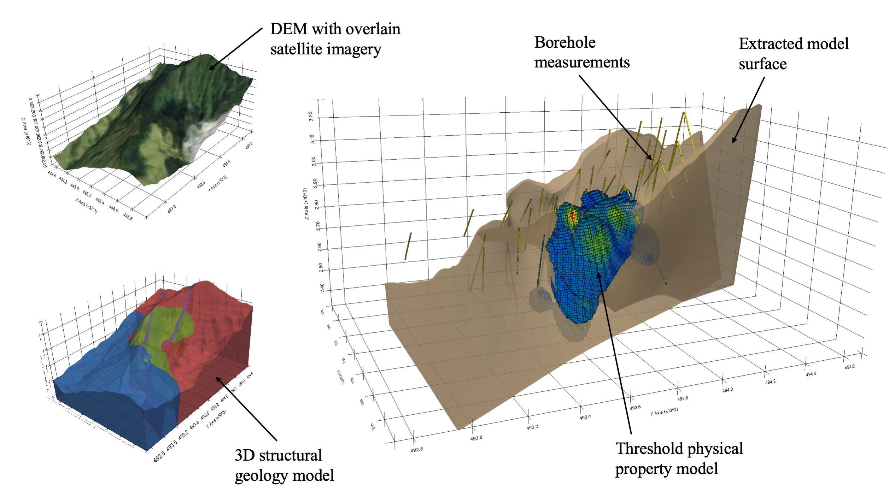

3D Geoscience
=============

Building three-dimensional (3D) subsurface models from field data and imaging techniques is a ubiquitous task in geological, hydrological, and resource estimation studies [1, 2]. These created models and results often hold high significance to stakeholders, yet the availability of open software to build, integrate, and make decisions with these data and models remains limited. Geoscientists need an underlying framework that can handle a variety of 3D data structures and visualize complex geospatial data types in addition to the limited data types that current free software handle. Such a framework would need to act as a glue across existing geo-software, streamlining data management, visualization, and development of reproducible research workflows.

Available free and open-source software to integrate subsurface information as well as to visualize those data in a 3D rendering space is limited. The limitations have arisen from disconnects between commercial software used across industry and a lack of open-source tooling within the research community. With little to no open software available, steep licensing fees for commercial software have created a barrier to entry for working in complex 3D environments. These high costs are arguably most relevant in academic and consulting settings, where research budgets are limited. Lack of software availability often leaves researchers without a toolset for integration across their different data types, such as pairing well locations, resource models, and geophysical images as shown in Figure 1.1, which can hinder their ability to interpret the spatial relationships of varying data types. This thesis proposes a new framework, PyVista, for managing and visualizing 3D geoscientific data to enhance how researchers explore, process, and communicate their data and spatial findings.

    An example of a typical subsurface study where data and models are co-located, including contextual information (DEM and satellite imagery), borehole measurements, a 3D structural geology model, and a 3D physical property model.

Data Management & Integration
-----------------------------

The subsurface models and data in typical hydrological or geophysical studies come in many forms, typically depending on available data, the expertise of the researcher, and the tooling to create and interpret such models. The value of these models is most significant when they can be co-located with other models, data, and site information in a unified environment for processing, modeling, and 3D visualization [2]. A typical hydrogeophysical investigation, for instance, might include the data types shown in Figure 1.2: a) geospatial and site contextual information, b) digital elevation models (DEMs) and LiDAR scans, c) 2D geophysical image sections (produced by ground-penetrating radar or shallow seismic methods), d) sparse observational data (geochemical sampling, surface magnetic responses, etc.), e) 3D structural geology models, or even f) 3D geophysical models or images. Additional data types include well logs, hydrological pumping data, water table monitoring data, and more. There is a wide range of data types present in typical hydrogeophysical studies; being able to gather all of the data types for a given project into a single framework for co-interpretation and analysis is challenging and often unachievable at an affordable cost.

.. figure:: ./images/data-types.png

    Typical data types found in subsurface research.

There are packages available for geoscientific data integration and visualization, however, these software often handle a few proprietary data formats and are closed-source with licensing fees. Having the ability to fuse datasets, construct 3D models, or generate horizons within the visualizations can be what separates closed-source software from open-source software. To date, there is no underlying framework for managing data types with a spatial reference that is open and extensible for the diversity of data types in subsurface science. Notable efforts have succeeded in creating robust frameworks such as Xarray [3] for regularly gridded data, GeoPandas [4] for geospatial feature data sets, or PyHSPF for hydrologic and water quality data integration [5]. Many of the existing tools are limited in the types of 3D data and geometries they can store and lack a clear connection to other software for data exchange and visualization. These limitations present a need for a robust and general toolset for working with spatial data that brings interoperability across existing scientific research software.

3D Visualization and Fusion
---------------------------

The term visual fusion refers to the synthesis of spatial data from multiple sources to provide a single view of all of the points and attributes of those data sources. In the geosciences, researchers often need 3D and 4D (time-varying) visualizations to understand complex spatial and temporal relationships in data, relationships that are challenging to capture in 2D visualizations [2]. Better perceptions or new understandings may arise from data when referenced in relation to intuitive features like topography, well locations, survey points, or other known information. Visualizing the spatial organization of the subsurface is necessary for geoscientists and stakeholders to be able to directly engage with their data and gain insight [1, 2, 6]. Current practices require skilled personnel to simultaneously evaluate data and models on various 2D planes: a qualitative and partial representation of complex subsurface data [1]. These qualitative investigation techniques can lead to incorrect findings, but this can be mitigated through visual fusion in an integrated 3D environment [1, 2].

While the availability of software for data integration and management is limited, there is a wide availability of 3D visualization software suitable for geoscientific data. However, it is important to note that many of the open-source packages are not capable of handling spatially-referenced datasets with complex geometries, and some are powerful yet have inherently complex application programming interfaces (APIs). Table 1.1 provides a list of many free visualization software capable of integrating geoscience datasets with interpretation and model building in mind. Table 1.1 compares: API Complexity (the software’s relative ease of use in a programming environment), Data Structures (describes whether the software has explicit spatial data structures for managing spatial data), and Scripting (describes whether the software can be incorporated into reproducible workflows).

TODO: insert table

The Rise of Python-based Research Software
------------------------------------------

Development for the next generation of geoscience research software focuses on being widely available and approachable, achieved through the open-source model, and enabling anyone to contribute code and anyone to use those tools. Examples of emerging open software in the geosciences include implicit geological modeling software like GemPy [7] and geophysical simulation and inversion software like SimPEG [8] and PyGIMLi [9] as well as larger efforts including the `Pangeo Project <https://pangeo.io/>`_: all of these are built atop the Python data science ecosystem. Python’s popularity is rising because it is both relatively easy to learn and flexible, making consistent, well-tested tools that can be extended, adapted, and combined readily accessible to researchers [8]. As an interpreted language, Python facilitates interactive development and visualization of results throughout research workflows. The interactive nature of Python has led to its rise as the central tool around emerging research topics where researchers can rapidly explore their data, gain insight, and make decisions in-situ.

With the rapid growth of Python-based software, differences between data types have made the integration of data and workflows complicated and non-reproducible. This is especially relevant in the case of closed source software where scripting interfaces exist but are often sandboxed into a framework that makes it challenging to work with external software. Furthermore, geoscientists often use specific visualization software for different data processing routines, which can lead to using several different visualization and analysis environments for a single project: further fragmenting their workflows and decreasing reproducibility. The availability of software for interactive analysis of complex geospatial data is limited due in part to inconsistencies around data integration and exchange which make it challenging for researchers to work across many of the open software tools. The inconsistencies around data integration and exchange result from the wide variety of data types used in geoscientific research as well as differences in physical scale and properties that are represented by those data. The Python software ecosystem for geoscientific research needs an open and extensible framework for data management and visualization to mitigate these challenges.
