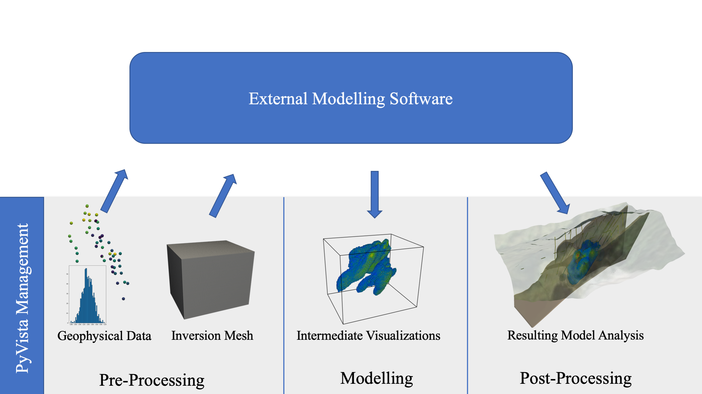

Reproducible Workflows
======================

Data exploration is the process of quickly extracting insight from data, typically through visualization techniques, when the investigator is unaware of regions or attributes of interest at the onset [16]. In traditional scientific computing workflows, researchers use data exploration techniques to gain insight into the raw data when pre-processing to inform decisions during simulation/modeling as well as to gain insight from the modeling results. The ability to rapidly visualize and explore spatial datasets in geoscientific research would provide an invaluable tool to drive decision making and build insight throughout the scientific computing process.

The PyVista framework has created an ecosystem of software built atop PyVista’s robust wrappings of VTK, making it relatively straightforward to develop custom visualization and mesh analysis tools for subdomain problems. The PVGeo software package (see Appendix A) is one such effort that has routines tailored to data visualization and analysis in the geosciences with a heavy focus on structured data sets like 2D or 3D time-varying grids. Other tools that are built atop PyVista include omfvista6 for 3D visualization of the Open Mining Format (OMF), PyMeshFix12 for repairing holes in PyVista surface meshes, and TetGen13 for generating tetrahedral meshes of any 3D polyhedral domains. Furthermore, several geoscience-oriented Python software link to PyVista; an example geostatistical modeling with GSTools [17] will be demonstrated in Section 2.3 of this chapter.

The PyVista data management and visualization framework enables exploration at every stage of computing workflows. Since PyVista’s data structures are built with a direct access NumPy10 interface, the data can be passed to external Python processing and analysis routines then collected directly back into the PyVista data structures at any stage of the workflow. This would enable, for example, a geophysical inversion workflow where observational data is passed to an external modeling library, and the intermediate results of the inversion could be displayed in real-time at each realization: this workflow is demonstrated in Figure 2.9.

In this case, PyVista acts as an underlying data management platform that stores and visually integrates geospatial data. Figure 2.9 demonstrates PyVista’s role as a data management framework with 3D visualization and analysis built-in as a tool for sending data to external software and collecting their results for visual fusion. As an underlying layer managing all of the data for a given geoscientific investigation, PyVista leverages data standards common throughout the Python computing stack to make interoperability and data exchange simple. The following sections demonstrate geocomputing research workflows where PyVista manages the spatial data providing exploration tools while other scientific computing libraries are used for modeling.

    A typical geoscientific computing workflow (left to right) where PyVista can manage and visualize the data for exploration and insight at each stage of the workflow.
