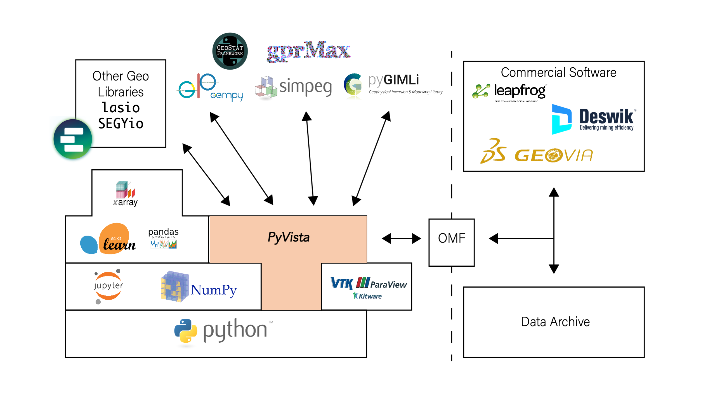

Wrap Up
=======

PyVista is a capable framework for geospatial data management and visual fusion, providing tools to integrate and make decisions with 3D data and models. The PyVista framework acts like a glue as an underlying layer connecting data management and visualization software with modeling and analysis libraries in the Python software ecosystem. :numref:`geo-stack` shows how PyVista builds on the open-source Python data science stack, including libraries like NumPy and VTK to create an underlying layer for open-source geocomputing software where data can be integrated and exchanged between previously fragmented software. Furthermore, through connections to open data standards like OMF and PyVista’s companion package omfvista6, data can be exchanged with commercial software platforms that support those standards.

As an open-source framework designed to be used by novice programmers, PyVista breaks down the barrier to entry for 3D visualization and data management that steep licensing fees from commercial software and complicated APIs in open software have created. Researchers are able to leverage PyVista to gather all the available data for a given project into a single workflow for visualization and interpretation through PyVista’s generalized and accessible 3D data structures. This software enhances researchers’ ability to explore, process, and communicate their spatial data and findings in a reproducible fashion. Particularly, the PyVista software provides a toolset for earth science researchers to rapidly visualize, explore, and gain insight into their spatial data: improving insight and decision-making processes throughout research workflows. This toolset can be expanded to develop custom visualization and analysis tools for subdomain problems, enabling the developers of geoscientific research software to have a spatial data management and 3D visualization framework available to integrate into their own software.

.. _geo-stack:

    PyVista as an underlying glue in the open-source geocomputing stack where data can be integrated and exchanged.

Furthermore, the PyVista software is designed to be used by the typical hydrologist or geophysicist with limited programming experience. This ease-of-use is made possible by building PyVista on top of a modern programming language, leveraging best practices for maintainability and usability, and streamlining the installation process for PyVista and its dependencies. These efforts were undertaken to move hydrologists toward sustainable software and data practices while smoothing the modern geoscientists’ transition into the era of open software.

Today the number of Python-based, open research software are growing rapidly, making powerful software immediately available to geoscientists: tooling that was previously only available from expensive, commercial software platforms. With this growth, new interfaces between new libraries and the ones shown in :numref:`geo-stack` will need to be further developed. In its current state, PyVista provides an intuitive framework for transferring data between software, but direct data-sharing interfaces have yet to be developed for many of these libraries. Since PyVista acts as a level playing field where geospatial data is managed and integrated, the scientific computing process becomes more dynamic across existing research tools. This further expands how available research software are able to exchange data and how researchers are able to create reproducible workflows: keeping all of their data within a single framework and leveraging the rapid growth of open-source software.

As new 3D geoscientific data types emerge and more massive datasets are collected, for example, the recent prevalence Distributed Acoustic Sensing (DAS) data, geospatial data integration and visualization will remain a dynamic challenge. Though PyVista provides an extensible framework for tackling current barriers around 3D geospatial data management and visualization, new challenges will emerge that will require further effort to build out data exchange and interoperability across geocomputing software. These efforts will need to see the rise of a centralized set of standards for working with spatial data in existing and emerging research software. Furthermore, scientific publishers will need to be adopted and enforce those standards to ensure that data processing and visualization routines for a publication are reproducible and verifiable. With the rapid growth of Python-based research software, these efforts will see rising momentum as new earth science software is released, and researchers continue to use the latest available tools. Thus expanding the need for a centralized framework for managing data between open software; PyVista is one such extensible framework well-positioned for that momentum.
